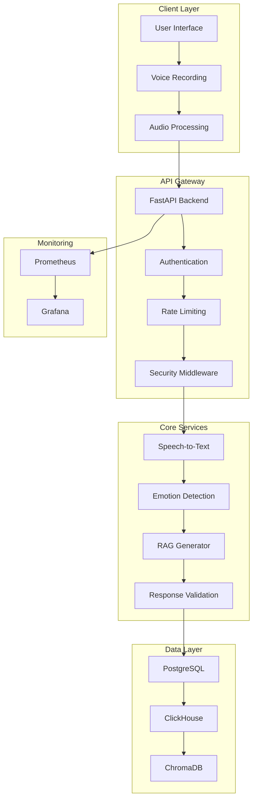
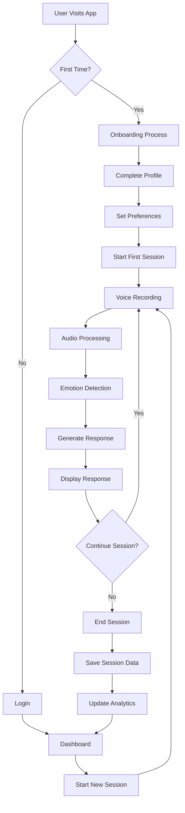
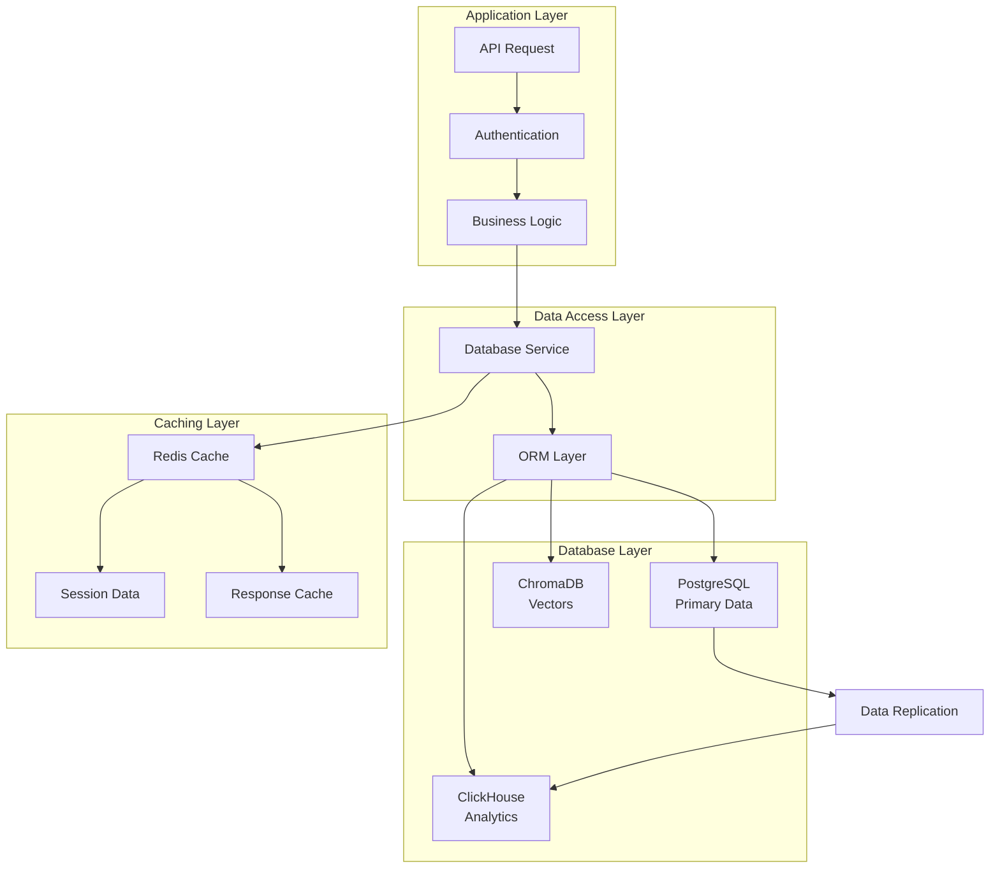
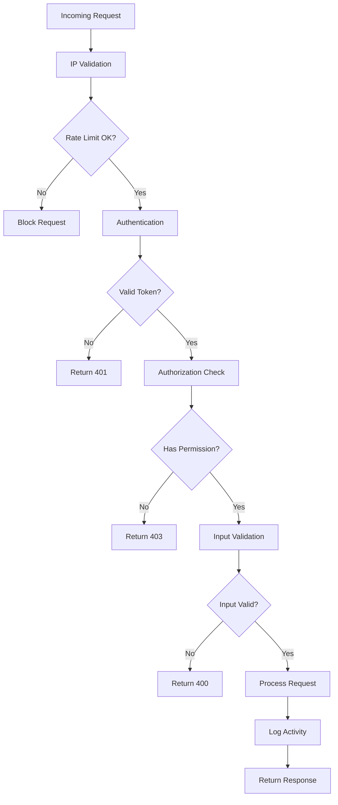
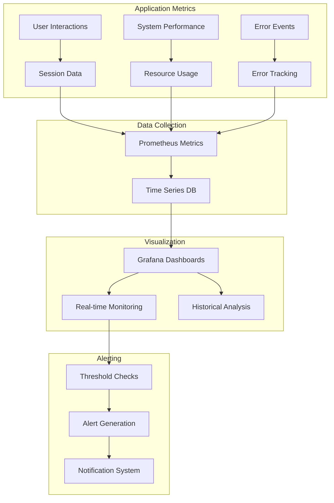
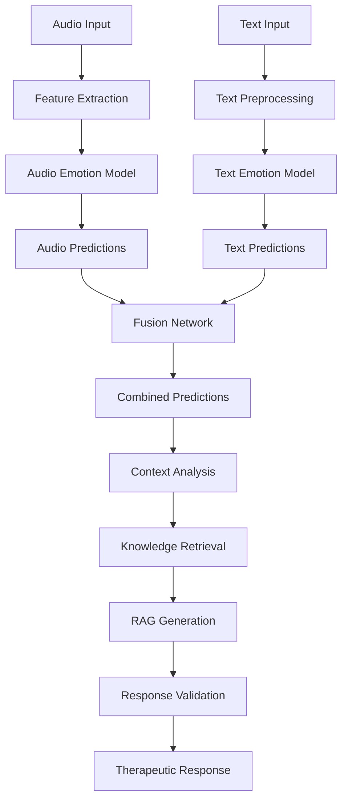
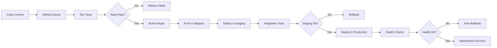
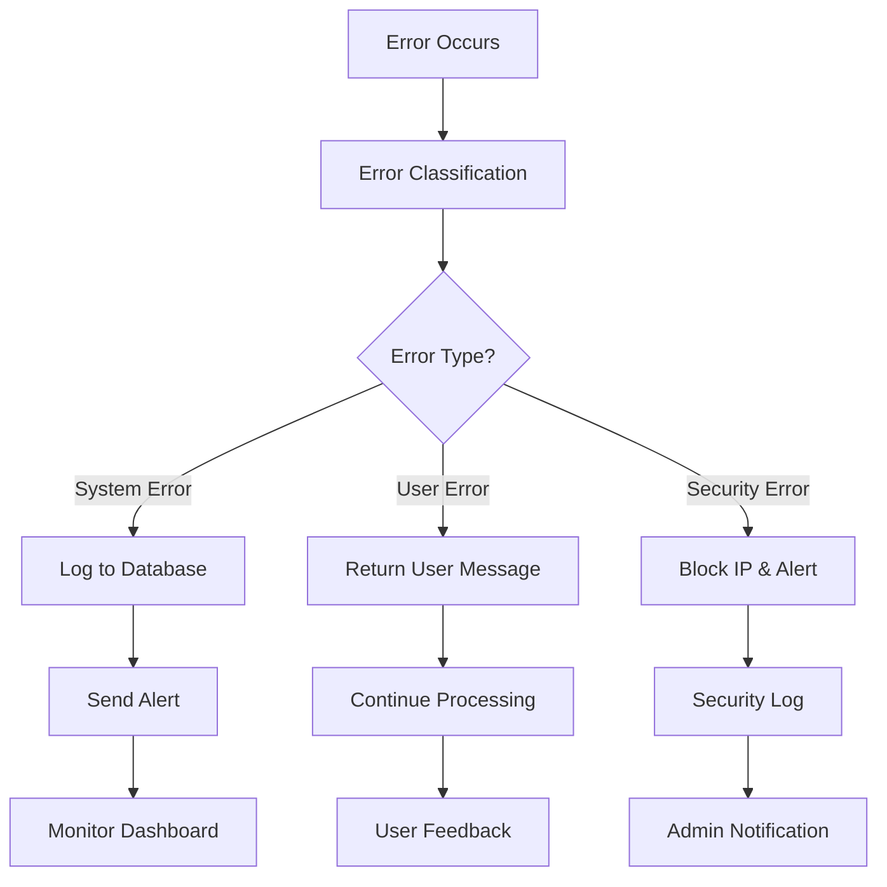
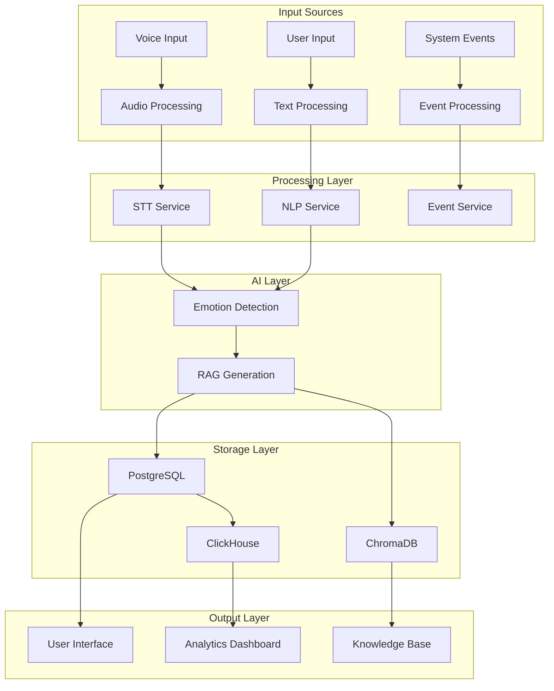

# 🔄 Voice CBT - System Flowcharts

## 1. High-Level System Architecture Flow

## 2. User Journey Flow

## 3. Audio Processing Pipeline

```mermaid
flowchart LR
    A[Audio Input] --> B[Preprocessing]
    B --> C[Noise Reduction]
    C --> D[Audio Enhancement]
    D --> E[Speech-to-Text]
    E --> F[Text Processing]
    F --> G[Emotion Analysis]
    G --> H[Context Extraction]
    H --> I[RAG Retrieval]
    I --> J[Response Generation]
    J --> K[Response Validation]
    K --> L[Audio Output]
```

## 4. Database Interaction Flow

## 5. Security Flow

## 6. Monitoring and Analytics Flow

## 7. AI Model Pipeline Flow

## 8. Deployment Flow

## 9. Error Handling Flow

## 10. Data Flow Architecture

