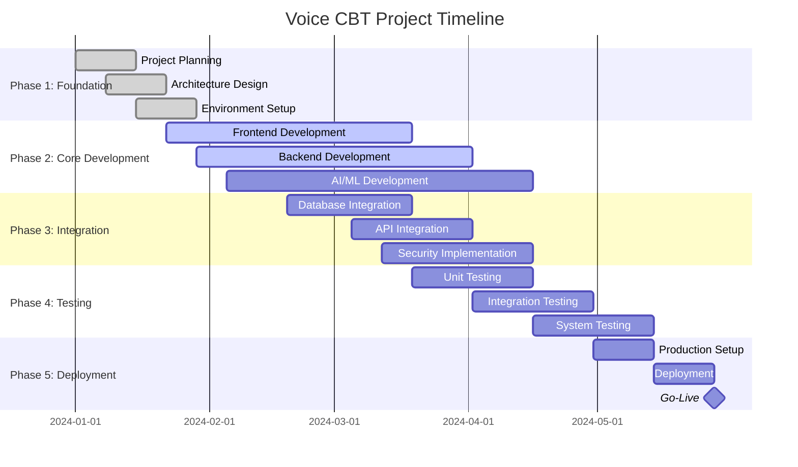
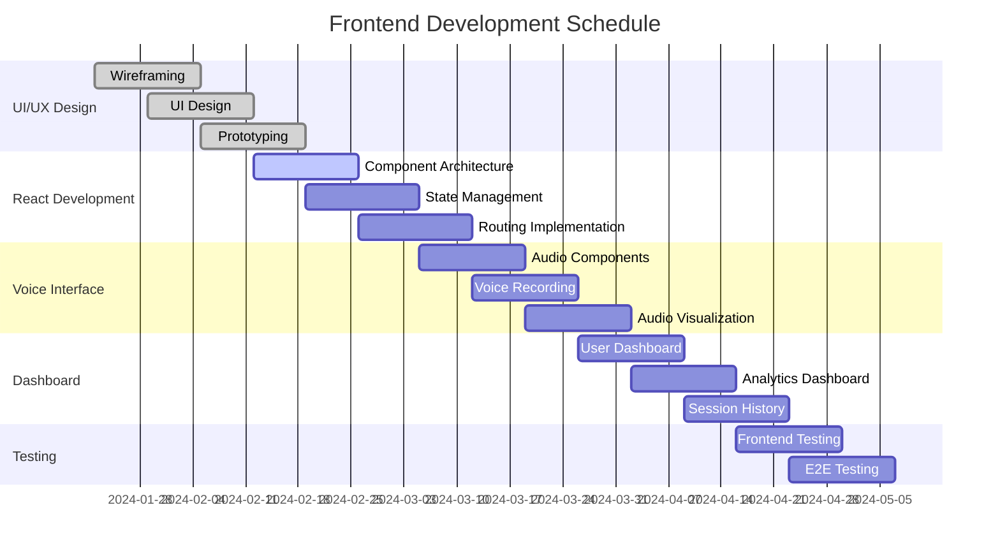
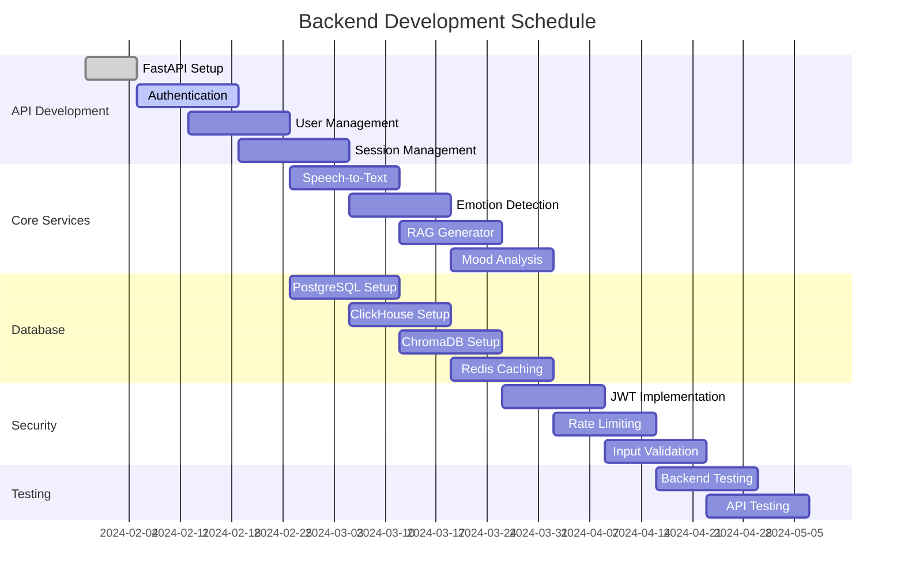
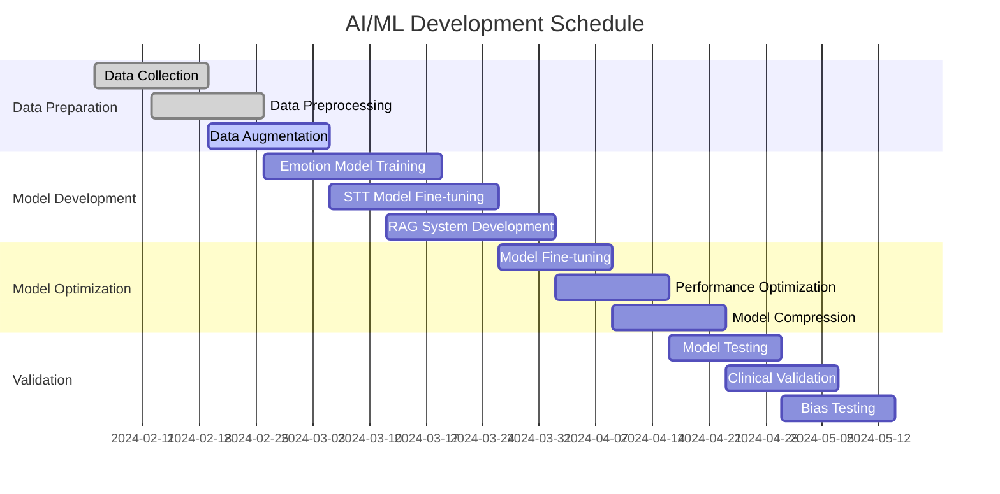
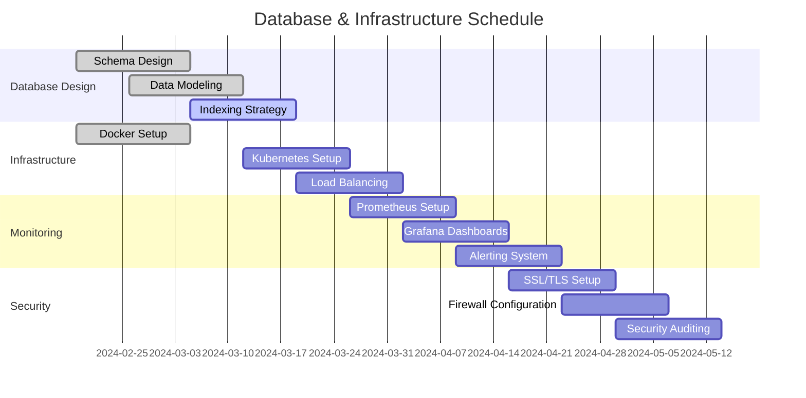
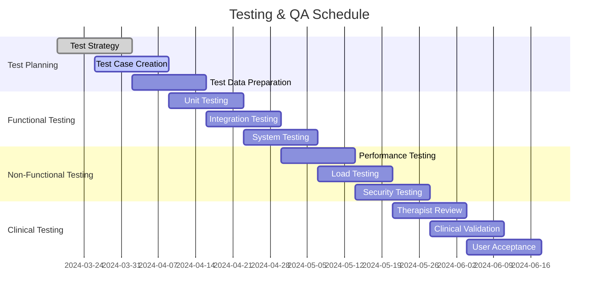
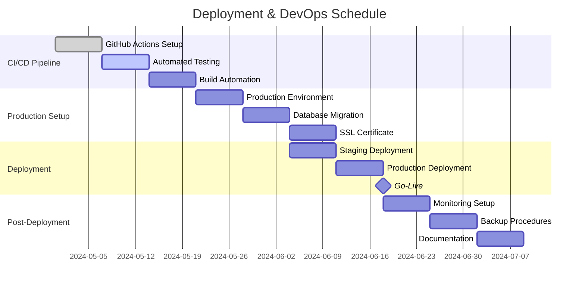
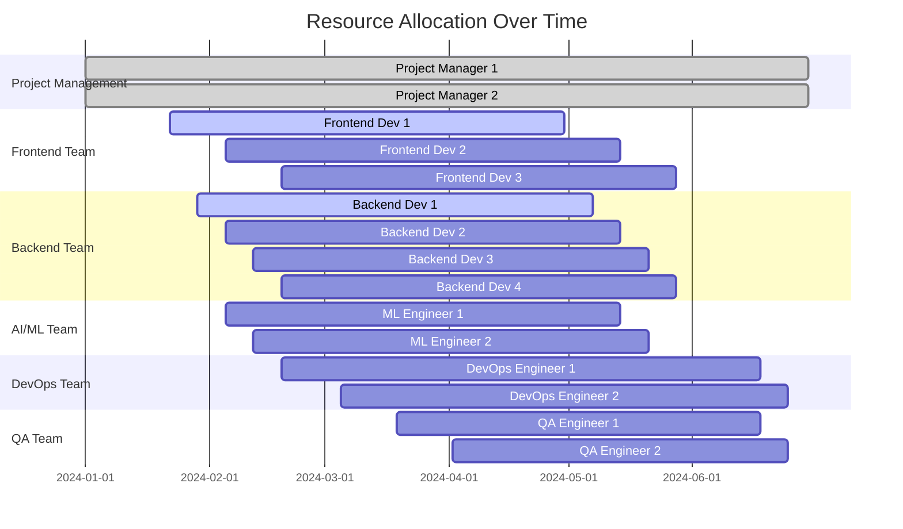
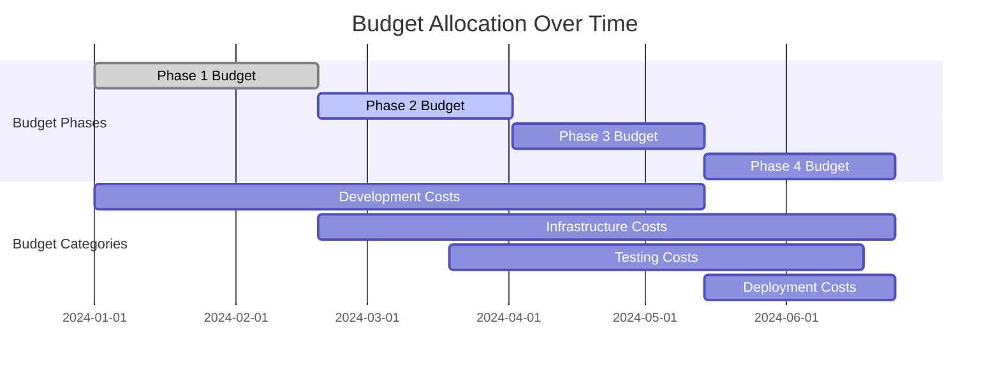
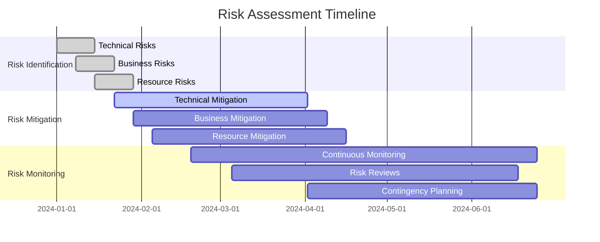

# 📅 Voice CBT - Gantt Charts & Project Timeline

## Project Overview
**Project Duration**: 6 months (24 weeks)  
**Start Date**: January 2024  
**End Date**: June 2024  
**Team Size**: 8-12 members  

---

## 1. High-Level Project Timeline

---

## 2. Frontend Development Timeline

---

## 3. Backend Development Timeline

---

## 4. AI/ML Development Timeline

---

## 5. Database & Infrastructure Timeline

---

## 6. Testing & Quality Assurance Timeline

---

## 7. Deployment & DevOps Timeline

---

## 8. Resource Allocation Timeline

---

## 9. Critical Path Analysis

### Critical Path Items (Cannot be delayed)
1. **Architecture Design** (Week 1-3)
2. **Database Schema Design** (Week 4-6)
3. **Core API Development** (Week 7-12)
4. **AI Model Training** (Week 8-14)
5. **Integration Testing** (Week 15-18)
6. **Production Deployment** (Week 19-24)

### Dependencies
- Frontend development depends on API completion
- AI/ML development depends on data preparation
- Testing depends on feature completion
- Deployment depends on testing completion

### Risk Mitigation
- **Parallel Development**: Frontend and backend development overlap
- **Early Testing**: Continuous testing throughout development
- **Buffer Time**: 2-week buffer for each major phase
- **Rollback Plan**: Ability to revert to previous stable version

---

## 10. Milestone Schedule

| Milestone | Date | Deliverables |
|-----------|------|--------------|
| **M1: Project Kickoff** | Jan 15, 2024 | Project charter, team setup, initial architecture |
| **M2: Design Complete** | Feb 19, 2024 | UI/UX designs, technical architecture, database schema |
| **M3: Core Development** | Apr 2, 2024 | Basic functionality, API endpoints, AI models |
| **M4: Integration** | May 7, 2024 | Full system integration, end-to-end functionality |
| **M5: Testing Complete** | Jun 4, 2024 | All testing phases complete, bugs resolved |
| **M6: Production Ready** | Jun 18, 2024 | Production deployment, monitoring, documentation |
| **M7: Go-Live** | Jun 25, 2024 | Public launch, user onboarding, support |

---

## 11. Budget Timeline

---

## 12. Risk Timeline

This comprehensive Gantt chart system provides a complete project timeline with dependencies, resource allocation, and risk management for the Voice CBT project.
